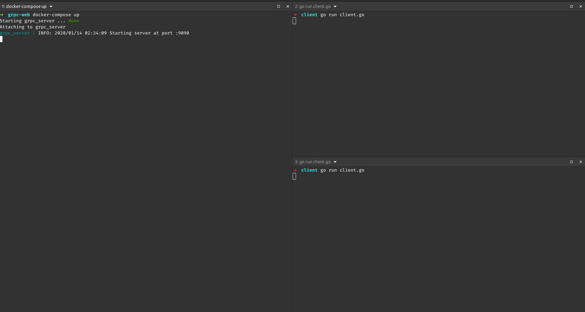
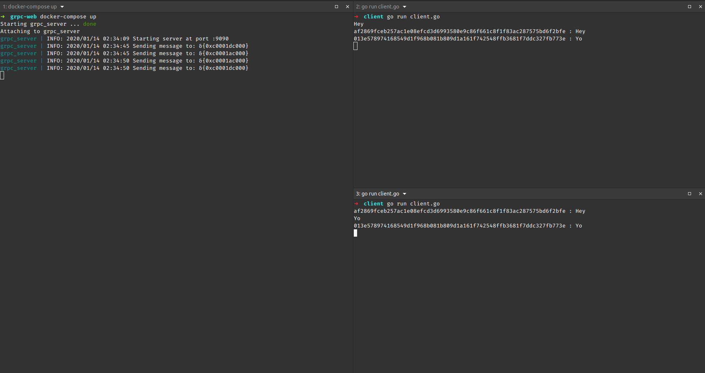

# GPRC proof of concept using Go

[gRPC](http://www.grpc.io/) is a modern, [HTTP2](https://hpbn.co/http2/)-based protocol, that provides RPC semantics using the strongly-typed *binary* data format of [protocol buffers](https://developers.google.com/protocol-buffers/docs/overview) across multiple languages (C++, C#, Golang, Java, Python, NodeJS, ObjectiveC, etc.)

## Run

* Run the server with `docker-compose up`
* Open two extra terminals and run `cd client && go run client.go`

* Start sending messages on the client terminals:

